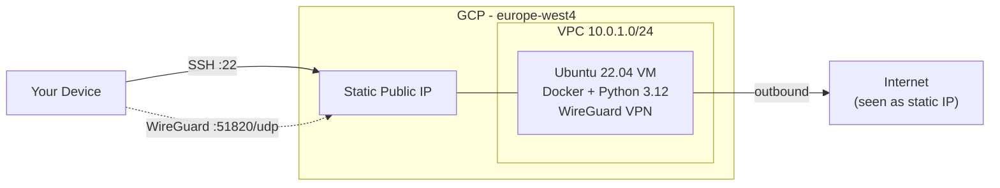

# GCP Deployment

Terraform project that deploys a general-purpose VM on Google Cloud Platform with Docker and Python 3.12 pre-installed. The VM gets a **static external IP** so it can be used for any workload that needs a fixed address.

As an additional feature, a [WireGuard](https://www.wireguard.com/) VPN server runs on the VM, allowing you to route your traffic through the static IP — useful for IP whitelisting on services like OTC providers.

## Architecture



## What's Provisioned

| Resource | Detail |
|---|---|
| **VPC** | Custom network with public subnet (`10.0.1.0/24`) |
| **Static IP** | Reserved external IP (persists across reboots) |
| **Firewall** | SSH (22/tcp) + WireGuard (51820/udp) open inbound |
| **VM** | Ubuntu 22.04 (`n2d-standard-2`) in `europe-west4-a` |
| **Startup script** | Installs Docker, Git, Python 3.12, clones this repo, starts WireGuard container |

## Prerequisites

- GCP account with billing enabled
- [Terraform](https://www.terraform.io/downloads.html) installed
- GCP service account key (JSON) with Compute Engine permissions
- SSH key pair on your local machine

## Quick Start

### 1. Generate SSH keys (if needed)

```bash
ssh-keygen -t rsa -b 4096 -C "your_email@example.com"
```

### 2. Add your GCP service account key

Place the JSON key file at `resources/gcp-key.json`.

### 3. Configure variables

Create `terraform.tfvars`:

```hcl
project_id      = "your-gcp-project-id"
ssh_user        = "ubuntu"
public_key_path = "~/.ssh/id_rsa.pub"
credential_file = "gcp-key.json"
```

### 4. Deploy

```bash
terraform init
terraform plan
terraform apply
```

Terraform outputs the static IP:

```bash
terraform output static_ip
```

### 5. Connect to the VM

```bash
ssh -i ~/.ssh/id_rsa ubuntu@$(terraform output -raw static_ip)
```

### 6. Destroy (when done)

```bash
terraform destroy
```

## WireGuard VPN (additional feature)

The VM automatically starts a WireGuard VPN server via Docker. This lets you tunnel all your traffic through the VM's static IP.

### Retrieve your client config

Copy the peer config directly to your machine with `scp`:

```bash
# Copy peer1 config file
scp -i ~/.ssh/id_rsa ubuntu@$(terraform output -raw static_ip):/opt/wireguard/wireguard-config/peer1/peer1.conf .

# Copy peer1 QR code image (for mobile)
scp -i ~/.ssh/id_rsa ubuntu@$(terraform output -raw static_ip):/opt/wireguard/wireguard-config/peer1/peer1.png .
```

### Connect from your device

- **Desktop**: Import `peer1.conf` into the [WireGuard app](https://www.wireguard.com/install/)
- **Mobile**: Scan the QR code from `peer1.png`

### Verify

```bash
curl ifconfig.me
# Should return the GCP static IP
```

## Project Structure

```
gcp_deployment/
├── provider.tf              # GCP provider config (hashicorp/google)
├── variables.tf             # Input variables
├── vpc.tf                   # VPC, subnet, static IP
├── firewall.tf              # Firewall rules (SSH + WireGuard)
├── vms.tf                   # VM instance (tags, static IP, startup script)
├── output.tf                # Outputs (static IP)
├── docker-compose.yml       # WireGuard container definition
├── terraform.tfvars         # Your variable values (not in git)
├── .gitignore
└── resources/
    ├── gcp-key.json         # GCP service account key (not in git)
    └── init.sh              # VM startup script (Docker + WireGuard setup)
```

## How the VPN Works

1. The startup script (`init.sh`) installs Docker, clones this repo into `/opt/wireguard`, and runs `docker compose up -d`
2. The `linuxserver/wireguard` container generates server keys and peer configs on first start
3. WireGuard listens on UDP port 51820
4. Clients connect using a peer config — all traffic is tunneled through the VM
5. The VM's static IP is the exit point for all tunneled traffic
